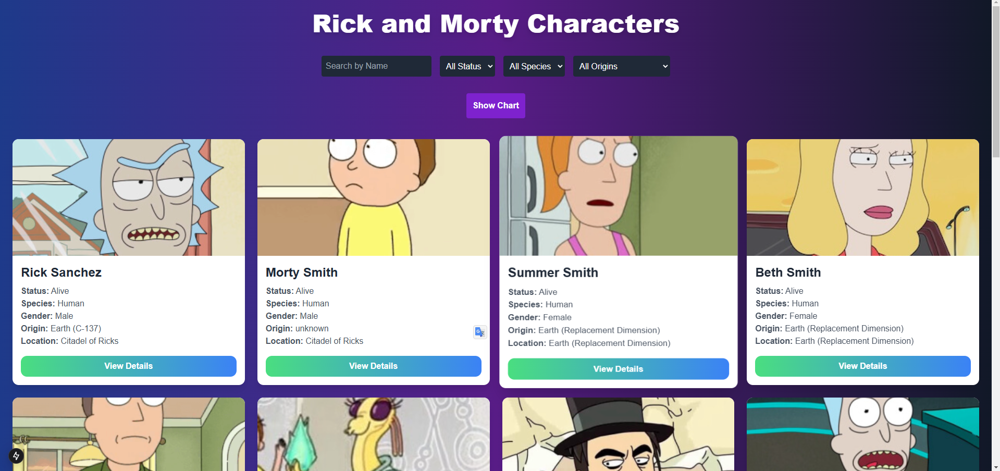
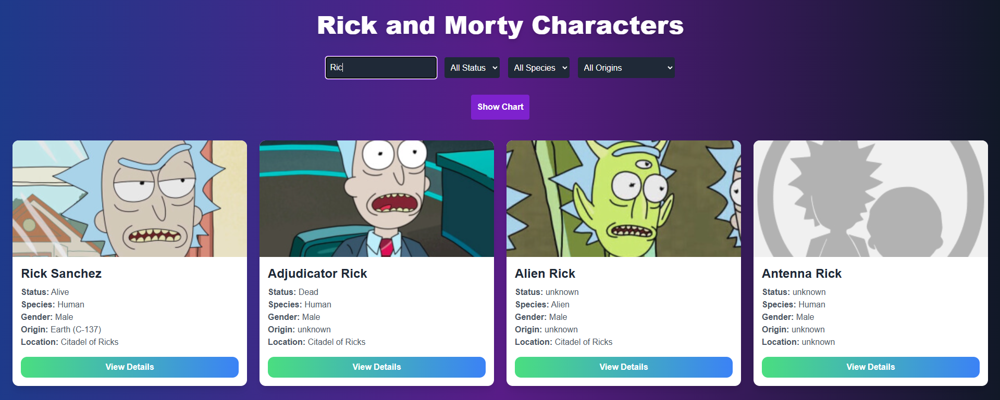
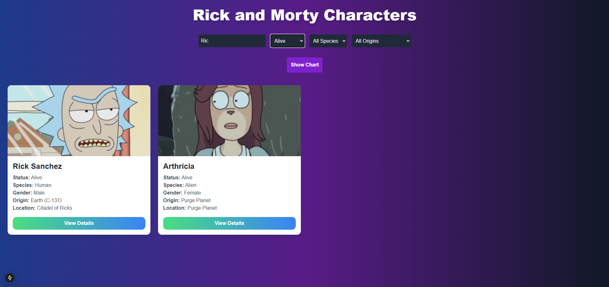
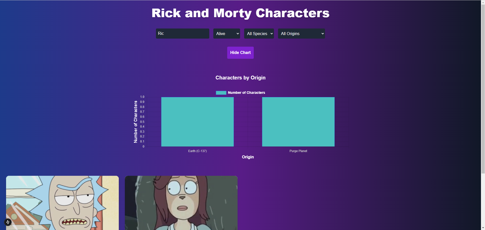
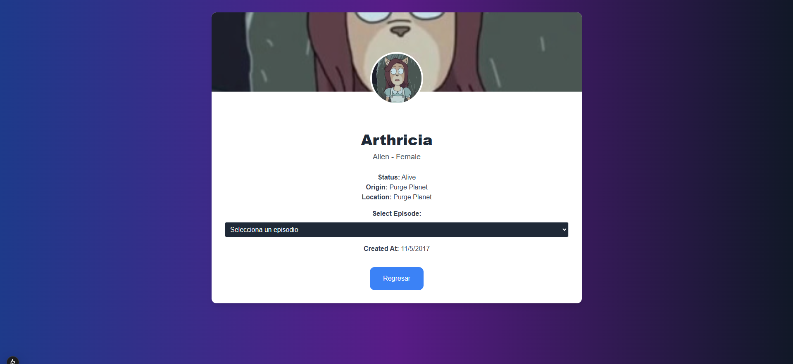

Proyecto Rick and Morty Characters

Una aplicación desarrollada en React y Next.js que permite explorar personajes de la serie "Rick and Morty". Incluye filtros avanzados por estado, especie y origen, además de visualizaciones interactivas con gráficos.

Características

Búsqueda y filtrado de personajes por:

Estado (Alive, Dead, Unknown).

Especie (Human, Alien, Robot).

Origen (Earth, Abadango, etc.).

Visualización interactiva de datos con gráficos.

Diseño responsivo y moderno.

Tecnologías

React: Librería para construir interfaces de usuario.

Next.js: Framework para renderizado del lado del servidor (SSR) y generación estática.

Chart.js: Para visualizaciones de datos.

Tailwind CSS: Para un diseño moderno y responsivo.

Configuración y Ejecución

Sigue estos pasos para configurar y ejecutar la aplicación:

1. Clonar el repositorio

https://github.com/PrubaTecnica/rick-and-morty.git
cd nombre-del-repositorio

2. Instalar dependencias

Con npm:

npm install

O con yarn:

yarn install

3. Ejecutar el servidor de desarrollo

Con npm:

npm run dev

O con yarn:

yarn dev

4. Abrir en el navegador

La aplicación estará disponible en:http://localhost:3000

Capturas de pantalla

Pantalla de inicio

Filtros y resultados

Gráfico interactivo

Mas detalles

Licencia

Este proyecto fue desarrollado exclusivamente para propósitos de una prueba técnica. No está destinado para uso comercial ni distribución pública.
